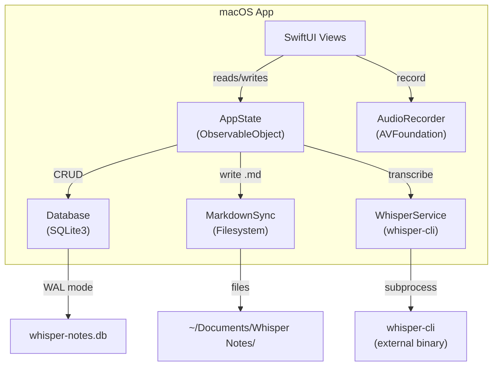
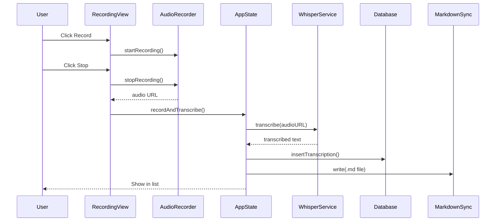
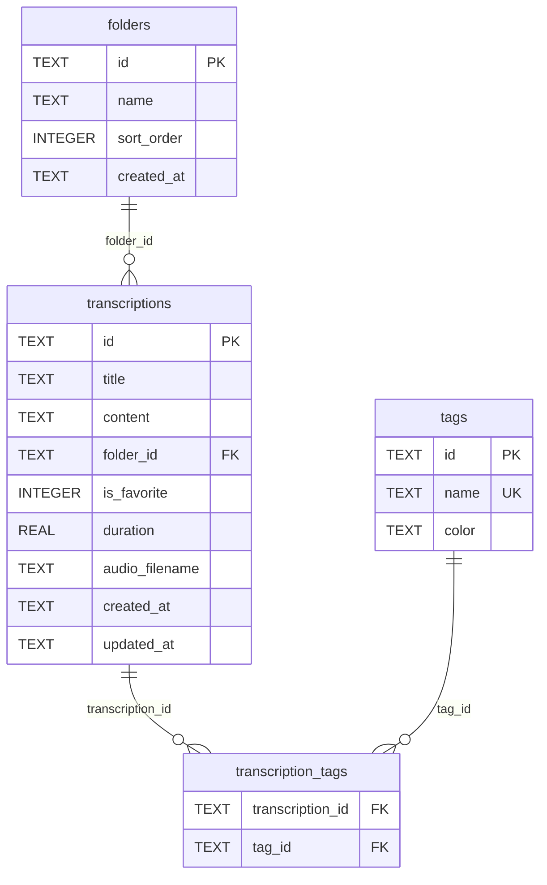

# Architecture

This document describes the high-level architecture of WhisperNotes for contributors who want to understand the codebase.

## System Overview



## Data Flow



## Component Responsibilities

| Component | File | Responsibility |
|-----------|------|----------------|
| **AppState** | `AppState.swift` | Single source of truth. All data mutations go through here. Published properties drive SwiftUI updates. |
| **Database** | `Database.swift` | Raw SQLite3 C API wrapper. WAL journal mode for concurrent reads. Foreign keys enforced. |
| **MarkdownSync** | `MarkdownSync.swift` | One-way sync (app -> filesystem). Writes `.md` files with YAML frontmatter. Non-critical — DB is source of truth. |
| **WhisperService** | `WhisperService.swift` | Runs `whisper-cli` as a subprocess via Foundation `Process`. Handles timeout and output parsing. |
| **AudioRecorder** | `AudioRecorder.swift` | AVAudioRecorder wrapper. Records 16kHz mono WAV (required by whisper.cpp). Manages microphone permissions. |
| **ContentView** | `ContentView.swift` | Root 3-column NavigationSplitView. Hosts delete confirmation alerts and error alerts. |
| **SidebarView** | `SidebarView.swift` | Left column: smart folders (All, Favorites, Recent, Uncategorized), user folders, tags. Drag-drop targets. |
| **TranscriptionListView** | `TranscriptionListView.swift` | Middle column: filtered list with search bar. Draggable rows. Context menus. |
| **TranscriptionDetailView** | `TranscriptionDetailView.swift` | Right column: title editor, content editor, metadata bar, tag management, export. Auto-saves on selection change. |
| **RecordingView** | `RecordingView.swift` | Modal sheet for recording. Folder picker, language override, waveform animation. |
| **SettingsView** | `SettingsView.swift` | Preferences window: whisper-cli path, model path, notes folder, language. |
| **LanguageSetupView** | `LanguageSetupView.swift` | First-launch onboarding for language selection. |

## Database Schema



**Key indexes:**
- `idx_transcriptions_folder` on `folder_id`
- `idx_transcriptions_favorite` on `is_favorite`
- `idx_transcriptions_created` on `created_at`

**Cascade rules:**
- Deleting a folder sets `folder_id = NULL` on its transcriptions (ON DELETE SET NULL)
- Deleting a transcription cascades to `transcription_tags` (ON DELETE CASCADE)
- Deleting a tag cascades to `transcription_tags` (ON DELETE CASCADE)

## State Management

```mermaid
graph LR
    subgraph "AppState (single ObservableObject)"
        Data["@Published transcriptions<br/>@Published folders<br/>@Published tags"]
        Nav["@Published sidebarSelection<br/>@Published selectedTranscription<br/>@Published searchText"]
        UI["@Published showRecording<br/>@Published isTranscribing<br/>@Published errorMessage"]
    end

    Views["SwiftUI Views"] -->|@EnvironmentObject| Data
    Views -->|@EnvironmentObject| Nav
    Views -->|@EnvironmentObject| UI
```

All views access AppState via `@EnvironmentObject`. There are no additional ViewModels or ObservableObjects.

## Key Design Decisions

1. **No external dependencies** — Only system frameworks (SwiftUI, AVFoundation, SQLite3). This keeps the build fast, reduces attack surface, and simplifies contributor onboarding.

2. **Raw SQLite3 over ORM** — Full control over queries, no abstraction overhead. WAL mode enables concurrent reads. Batch tag query (`fetchAllTranscriptionTags`) prevents N+1 problems.

3. **Single AppState** — One ObservableObject as the single source of truth prevents data inconsistency between views. All mutations are centralized.

4. **One-way markdown sync** — SQLite is the sole source of truth. Markdown files are a convenience export (compatible with Obsidian). Changes in Finder are NOT synced back.

5. **Library/executable split** — `WhisperNotesLib` contains all source code, `WhisperNotes` is a thin `@main` wrapper. This enables `@testable import WhisperNotesLib` for testing without launching the app.

6. **Keyboard shortcuts via counter trigger** — `searchFocusTrigger` uses increment (not boolean) to avoid SwiftUI `@FocusState` race conditions when triggered from menu commands.

## File Layout

```
Sources/
  WhisperNotes/          # Library target (WhisperNotesLib)
    AppState.swift
    Database.swift
    Models.swift
    WhisperService.swift
    MarkdownSync.swift
    AudioRecorder.swift
    ColorExtension.swift
    ContentView.swift
    SidebarView.swift
    TranscriptionListView.swift
    TranscriptionDetailView.swift
    RecordingView.swift
    SettingsView.swift
    LanguageSetupView.swift
  WhisperNotesApp/       # Executable target (WhisperNotes)
    WhisperNotesApp.swift  # @main entry point
Tests/
  WhisperNotesTests/     # Test target
Resources/
  Info.plist
  AppIcon.icns
```
