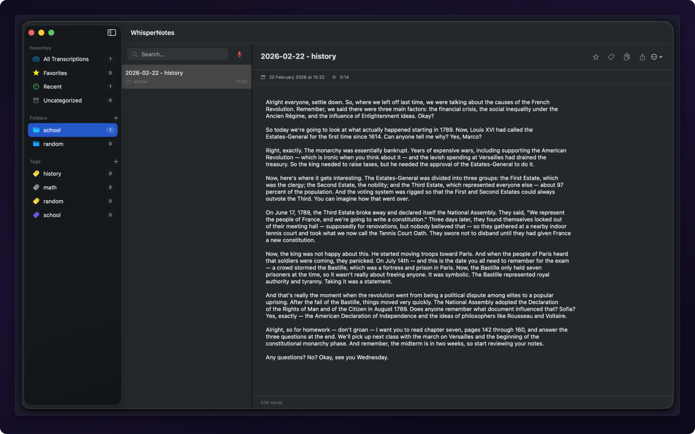
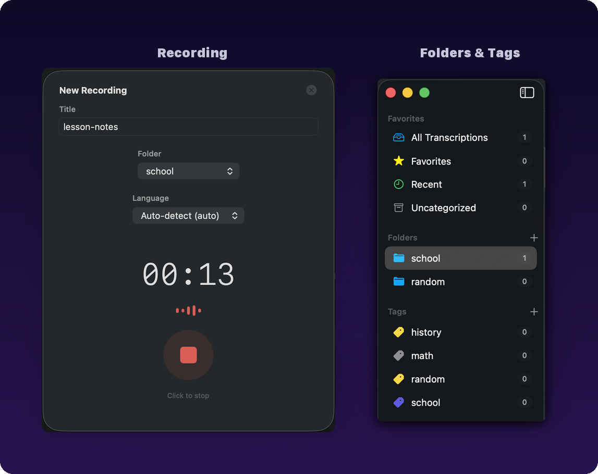
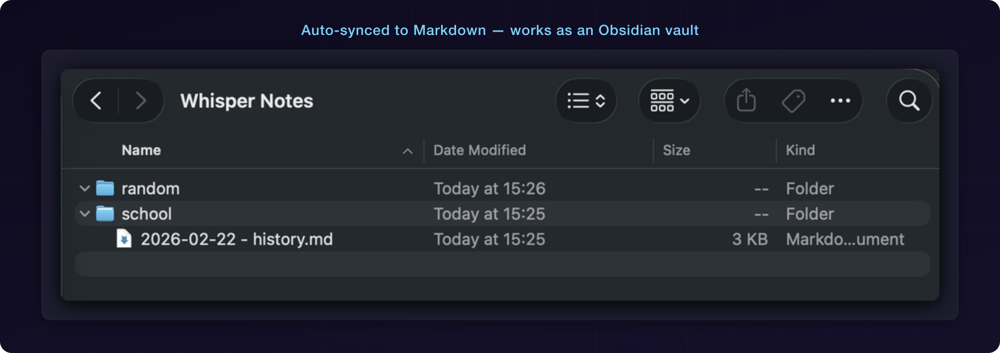

<div align="center">

# WhisperNotes

**Local-first voice transcription for macOS.**
Record, transcribe, organize — all on your machine. No cloud. No subscription. No telemetry.

[](https://github.com/reidemeister94/whisper-notes/actions/workflows/ci.yml)
[](LICENSE)
[](https://www.apple.com/macos/sonoma/)
[](https://swift.org)

</div>

<br/>

<p align="center">
  
</p>

WhisperNotes is a native macOS app that turns audio recordings into searchable, organized text using local transcription engines such as [whisper.cpp](https://github.com/ggerganov/whisper.cpp). Built with Swift and SwiftUI — no Electron, no web views, no telemetry. Just a fast, lightweight Mac app that respects your privacy.

---

## Why WhisperNotes?

Most transcription tools send your audio to someone else's server. WhisperNotes doesn't. Everything — recording, transcription, storage — happens on your Mac. Your meetings, notes, and ideas stay yours.

- **Truly private** — Audio never leaves your machine. No accounts, no API keys, no data collection.
- **Native performance** — Pure SwiftUI app. Launches instantly, uses minimal resources, feels like it belongs on your Mac.
- **Zero cost** — Free and open source. No subscription, no usage limits, no "premium tier".
- **Obsidian-ready** — Auto-syncs transcriptions as Markdown files with YAML frontmatter. Point Obsidian at the folder and you're done.

---

## Features

### Record & Organize

One-click recording with live waveform visualization. Organize with custom folders, color-coded tags, favorites, and full-text search. Drag and drop transcriptions between folders.

<p align="center">
  
</p>

### Markdown Sync

Every transcription is automatically saved as a `.md` file with YAML frontmatter. Works as an Obsidian vault out of the box — just point Obsidian at your notes folder.

<p align="center">
  
</p>

### And More

- **30 languages** — Set a default or choose per-recording. Auto-detect works great for most cases.
- **Optional Cohere Transcribe** — High-quality local transcription through a bundled backend. Setup is guided from Settings and runs on your Mac.
- **Keyboard-driven** — `Cmd+N` record, `Cmd+Shift+N` new folder, `Cmd+S` save, `Cmd+F` search, `Cmd+D` favorite
- **Edit in place** — Modify titles and transcription text directly in the app with autosave
- **Smart folders** — All, Favorites, Recent (last 7 days), and Uncategorized — always up to date

---

## Quick Start

### 1. Install whisper.cpp

```bash
git clone https://github.com/ggerganov/whisper.cpp.git
cd whisper.cpp
cmake -B build
cmake --build build --config Release

# Download a model (large-v3-turbo recommended)
./models/download-ggml-model.sh large-v3-turbo
```

### 2. Build WhisperNotes

```bash
git clone https://github.com/reidemeister94/whisper-notes.git
cd whisper-notes
./build.sh

# Optional: copy to Applications
cp -r WhisperNotes.app /Applications/
```

> **First launch:** Right-click the app > Open (to bypass Gatekeeper for unsigned apps).

### 3. Configure

Open **Settings** (`Cmd+,`) and point WhisperNotes to your whisper-cli binary and model file. Green indicators confirm the paths are valid.

| Setting | Description | Default |
|---------|-------------|---------|
| whisper-cli path | Path to the `whisper-cli` binary | `~/Documents/whisper.cpp/build/bin/whisper-cli` |
| Model path | Path to the GGML model file | `~/Documents/whisper.cpp/models/ggml-large-v3-turbo.bin` |
| Cohere Python executable | Optional Python used by the bundled Cohere backend | App Support virtual environment, or your selected Python |
| Notes folder | Where Markdown files are saved | `~/Documents/Whisper Notes/` |

For Cohere Transcribe, choose the engine in Settings and copy the setup command shown there. It installs Python dependencies into `~/Library/Application Support/WhisperNotes/CohereBackend/venv`; the model is downloaded by Hugging Face on first use.

---

## Requirements

- **macOS 14.0+** (Sonoma)
- **Apple Silicon** (M1/M2/M3/M4)
- **Xcode 15+** (for building from source)
- **Optional for Cohere Transcribe:** Python 3.11+, `ffmpeg`, and Hugging Face access to `CohereLabs/cohere-transcribe-03-2026`

---

## Architecture

No external dependencies. The entire app is built on system frameworks: SwiftUI, AVFoundation, and SQLite3.

- **Single state object** — One `AppState` ObservableObject manages everything
- **SQLite + WAL** — Fast concurrent reads, reliable persistence, batch tag queries
- **Markdown sync** — Every save writes a `.md` with YAML frontmatter (SQLite is source of truth)
- **Process-based transcription** — whisper-cli runs as a subprocess with configurable timeout

See [ARCHITECTURE.md](ARCHITECTURE.md) for detailed diagrams.

### Data locations

| What | Where |
|------|-------|
| Database | `~/Library/Application Support/WhisperNotes/whisper-notes.db` |
| Audio | `~/Library/Application Support/WhisperNotes/` |
| Markdown | `~/Documents/Whisper Notes/` (configurable) |

---

## Development

```bash
swift build              # Debug build
swift build -c release   # Release build
swift test               # Run all tests
```

```bash
make setup-dev-env       # Install SwiftLint, SwiftFormat, pre-commit hooks
make lint                # Run SwiftLint
make format              # Run SwiftFormat
```

See [CONTRIBUTING.md](CONTRIBUTING.md) for code style and PR guidelines.

---

## Troubleshooting

| Problem | Fix |
|---------|-----|
| "whisper-cli not found" | Check the path in Settings. Make sure whisper.cpp is built. |
| "Model not found" | Verify the model path in Settings. Re-download if corrupted. |
| Transcription timeout | Large files may exceed the 300s default. Check model file integrity. |
| No audio input | Grant microphone access in System Settings > Privacy & Security > Microphone. |
| App won't open | Right-click > Open on first launch to bypass Gatekeeper. |
| Cohere Python not found | Open Settings > Cohere Transcribe, run the setup command, then click "Use app venv". |
| Cohere model access error | Accept the model terms on Hugging Face and run `hf auth login`. |

---

## Contributing

Contributions are welcome. See [CONTRIBUTING.md](CONTRIBUTING.md) for setup instructions, commit conventions, and how to submit a PR.

---

## License

MIT — see [LICENSE](LICENSE).

## Acknowledgments

- [whisper.cpp](https://github.com/ggerganov/whisper.cpp) by Georgi Gerganov
- [OpenAI Whisper](https://github.com/openai/whisper) — the original speech recognition model
